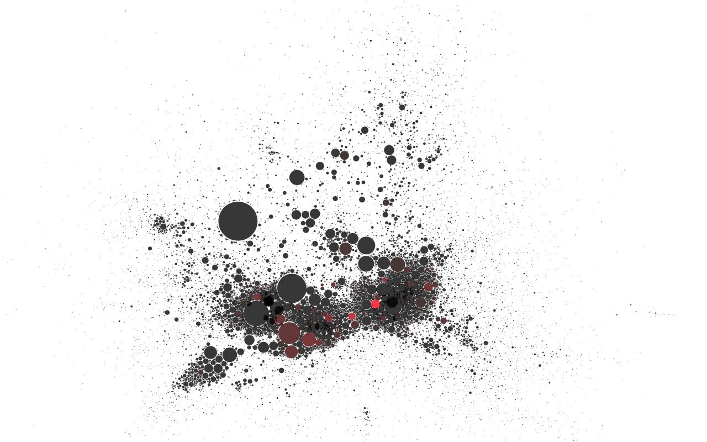
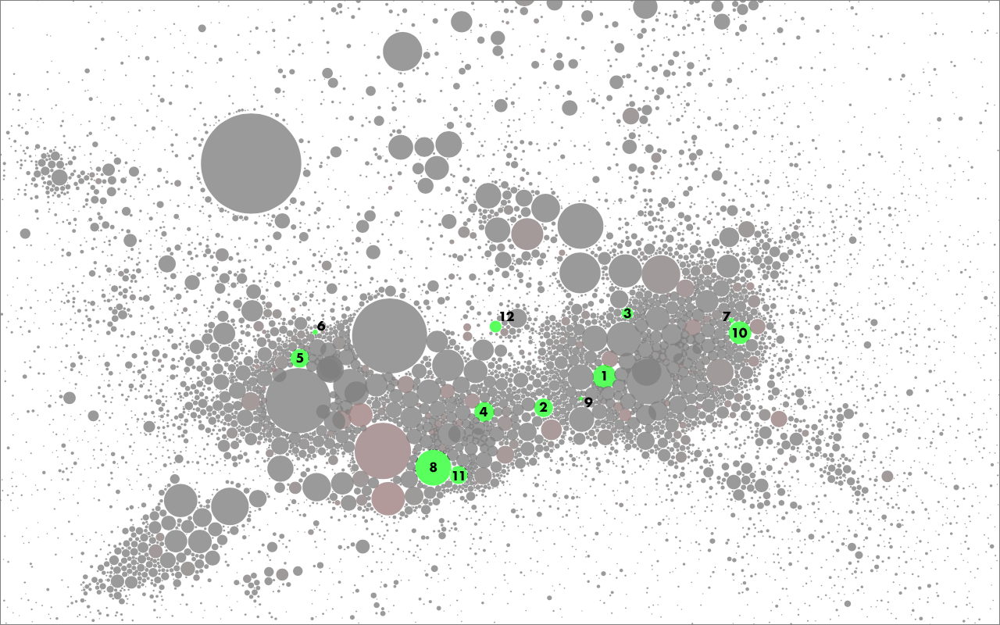
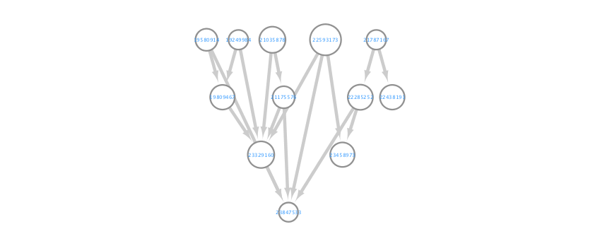

# 

# Overview

**LitReviews**, or LitR *(pronounced lighter)*, is a collection of tools to create an **automated** and **systematic** method of conducting **literature reviews in science**. By using **existing APIs** (application programming interfaces), **graph theory**, and **GPU accelerated processing/visualizations**, LitR will hopefully give the user a sense of what ideas, topics, methods, and funding are currently "hot" within a given field of interest.

## Projects

1. [**PubCrawl**](#pubcrawl) - Uses NCBI E-Utilites via BioPython package to search PubMed and pull metadata. Written in Python 3 and visualized in Cytoscape.
2. [**PubCrawlR**](#pubcrawlr) - Future development. Will likely be an extension to PubCrawl which uses R for statistical analyses on metadata.
3. [**CrossCheck**](#crosscheck) - Future development. Citation metadata and funding analyzer using NIH RePORTER (or CrossRef as suggested by Ben Wilks).

Please see [works referenced](#works-referenced) for information about the original works on which LitR builds upon.

# Example

## Traumatic Brain Injury Citation Map

### Objective: 

1. Find out what ideas are popular within traumatic brain injury based on the papers the field references. 
1. Generate a systematic method for exploring these ideas.

### Method:

1. Search Pubmed for "traumatic brain injury". Yields about ~38,000 records.
1. For all ~38k articles, list their references.
1. Keep track of references that occur in multiple articles.
1. Use graph theory metrics to visualize and calculate metrics for the citation network.
    * Positions are determined by spring-electric modelling. Learn more about how the following network graph was made at [cytoscape](http://www.cytoscape.org/) and [allegroviva](http://allegroviva.com/allegrolayout2/force-directed-layouts/) (video).
    * In short, nodes that are linked together (via citation) are drawn closer together. Otherwise, nodes repel one another.   

### Results:

1. Shown above is ~15,000 articles (circles/nodes).
    * Limited by NCBI FLink output. 
1. Although links are not shown, the network below is completely connected (i.e. if you place your finger on one node, it is possible to trace a path to another node).
1. Size = Citation count
    * e.g., The largest node was cited by 395 TBI articles from the original search term.
        

## Using graph theory to determine potentially interesting articles.

* Red = Stress. 
    * "Stress is calculated by measuring the number of shortest paths passing through a node."
    * "The stress of a node in a [network]...can indicate the relevance of [that node] as functionally capable of holding together communicating nodes." Definition slightly reworded by me. Please read original paper linked below.
    * Source: http://www.cbmc.it/~scardonig/centiscape/CentiScaPefiles/CentralitiesTutorial.pdf (Research team cited below)

### Top 12 Stressed Articles for Traumatic Brain Injury (As of Fall 2016)
|#|PMID|Title|Authors|Journal|Year|
|-|----|-----|-------|-------|----|
|1|23329160|Animal models of traumatic brain injury.|Xiong Y, Mahmood A, Chopp M.|Nat Rev Neurosci.| 2013 
|2|19809467|Traumatic brain injury: an overview of pathobiology with emphasis on military populations.|Cernak I, Noble-Haeusslein LJ.|J Cereb Blood Flow Metab.| 2010
|3|21175576|Animal modelling of traumatic brain injury in preclinical drug development: where do we go from here?|Marklund N, Hillered L.|Br J Pharmacol.|2011
|4|22285252|Axonal pathology in traumatic brain injury.|Johnson VE, Stewart W, Smith DH.|Exp Neurol.|2013 
|5|22438191|A review of magnetic resonance imaging and diffusion tensor imaging findings in mild traumatic brain injury.|Shenton ME, Hamoda HM, Schneiderman JS, Bouix S, Pasternak O, Rathi Y, Vu MA, Purohit MP, Helmer K, Koerte I, Lin AP, Westin CF, Kikinis R, Kubicki M, Stern RA, Zafonte R.|Brain Imaging Behav.|2012 
|6|21787167|Emerging imaging tools for use with traumatic brain injury research.|Hunter JV, Wilde EA, Tong KA, Holshouser BA.|J Neurotrauma.|2012 
|7|19249984|Emerging treatments for traumatic brain injury.|Xiong Y, Mahmood A, Chopp M.|Expert Opin Emerg Drugs.|2009 
|8|22593173|Chronic traumatic encephalopathy in blast-exposed military veterans and a blast neurotrauma mouse model.|Goldstein LE, Fisher AM, Tagge CA, Zhang XL, Velisek L, Sullivan JA, Upreti C, Kracht JM, Ericsson M, Wojnarowicz MW, Goletiani CJ, Maglakelidze GM, Casey N, Moncaster JA, Minaeva O, Moir RD, Nowinski CJ, Stern RA, Cantu RC, Geiling J, Blusztajn JK, Wolozin BL, Ikezu T, Stein TD, Budson AE, Kowall NW, Chargin D, Sharon A, Saman S, Hall GF, Moss WC, Cleveland RO, Tanzi RE, Stanton PK, McKee AC.|Sci Transl Med.| 2012 
|9|23847533|Molecular mechanisms of cognitive dysfunction following traumatic brain injury.|Walker KR, Tesco G.|Front Aging Neurosci.|2013 
|10|21035878|Neuroprotection for traumatic brain injury: translational challenges and emerging therapeutic strategies.|Loane DJ, Faden AI.|Trends Pharmacol Sci.|2010
|11|23458973|Chronic neuropathologies of single and repetitive TBI: substrates of dementia?|Smith DH, Johnson VE, Stewart W.|Nat Rev Neurol.|2013 
|12|19580914|Persistent cognitive dysfunction after traumatic brain injury: A dopamine hypothesis.|Bales JW, Wagner AK, Kline AE, Dixon CE.|Neurosci Biobehav Rev.|2009

### Citation Hierarchy of Top 12 Stressed Articles

Reading the 3 papers towards the bottom of the picture may be a good way of covering many of the ideas expressed in the previous papers.

* A --> B means A is cited in B

# Look for one of many undecided upon logos.

    

 

    

# PubCrawl

# PubCrawlR

# CrossCheck

# Works Referenced
[Back to top](#overview)

* [BioPython](https://github.com/biopython/biopython)
    * Cock, P.J.A. et al. Biopython: freely available Python tools for computational molecular biology and bioinformatics. Bioinformatics 2009 Jun 1; 25(11) 1422-3 http://dx.doi.org/10.1093/bioinformatics/btp163 pmid:19304878
    
* [CytoScape](http://www.cytoscape.org/)
    * Shannon P, Markiel A, Ozier O, Baliga NS, Wang JT, Ramage D, Amin N, Schwikowski B, Ideker T. Cytoscape: a software environment for integrated models of biomolecular interaction networks. Genome Research 2003 Nov; 13(11):2498-504
    
* [NCBI](https://www.ncbi.nlm.nih.gov/Structure/flink/flink.cgi)
    * FLink: Frequency weighted links [Internet]. Bethesda (MD): National Library of Medicine (US), National Center for Biotechnology Information. 2010. Available from: https://www.ncbi.nlm.nih.gov/Structure/flink/flink.cgi
    
* [CentiScape](https://bitbucket.org/giovanniscardoni/centiscapepublic)
    * Scardoni G, Tosadori G, Faizan M, Spoto F, Fabbri F, Laudanna C. Biological network analysis with CentiScaPe: centralities and experimental dataset integration. F1000Research. 2014;3:139. doi:10.12688/f1000research.4477.2.

# Artwork

Logos designed and created by Adewole C. Oyalowo using icons provided free by [EmojiOne](http://emojione.com/).
