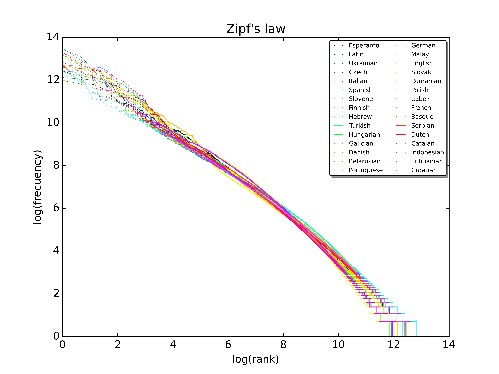
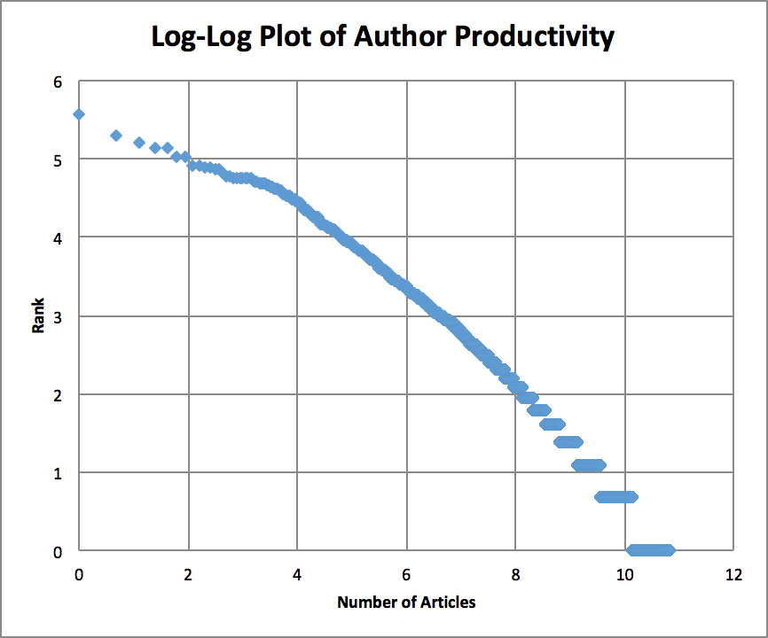
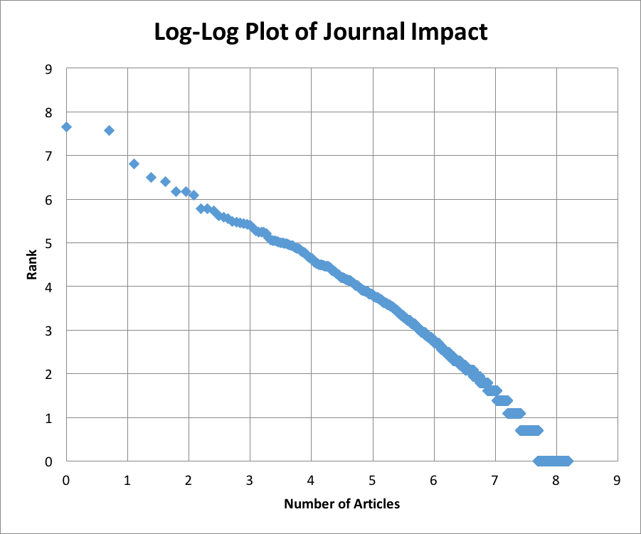

# Background

## Problem

Our project is a metastudy of research into *Traumatic Brain Injury*. We are hoping to determine whether the number of times a paper is cited can be predicted with any degree of accuracy using features of the article.
That is, are papers on this topic more likely to be cited strictly based on their content or on more extraneous features, such as publication date or the presence of a well-known author?

## Data

The data are all provided by the PubMed API.
A Python program (written by Ade as part of his broader work on this subject) creates a CSV file collecting metadata for all articles that match a given keyword (Title, PubMed ID, Authors, Date, Language, etc...).

The next program converts the data from the CSV file into a SQLite database.

Finally, a third program loads data from the database, converts it to NumPy matrices, and uses learning algorithms to make predictions about papers and their citations.

# Complications

## Complexity

The PubMed API produces a dataset that contains a large number of values, some of which are duplicated in various ways. These values must be culled, reformatted, and reorganized.
The data are also highly inconsistent:
* Some unique ID's are all unsigned integers, while others contain dashes and other characters. This means that some IDs can be treated as numeric values, while others must be treated as text strings. The queries used for this project relied on one consistent ID which could be treated as an integer value.
* There are several date fields marking different milestones in the publication process, but they are formatted in different ways. Some are missing the day and even the month (older citations from the 19th century tend to only record the year), while others have a full timestamp including a (presumably arbitrary) time of publication.
The algorithm must therefore cope with missing data, but eliminating all rows with missing data shrinks the dataset considerably. Instead these values were set to zero. Shrinking the dataset by filtering the input data in the initial SQL query turned out to be useful for debugging purposes though.
* The most disappointing setback we faced was determining page numbers and, as a result, article length. The information about page numbers is ostensibly included in the search results, which would theoretically make it possible to calculate article length. However, the quality of these data is so low that it would only be possible to process it accurately in 30-40% percent of cases (by rough estimation). If there were a way to calculate article length, that value could be compared with other metrics in potentially illuminating ways. For example, are short articles likely to have fewer citations? It might eventually be possible to gather this information in other ways (for instance, by scraping the PubMed site directly and counting the number of page images shown), but for now this value is unobtainable.
* Dealing with a reasonably large dataset of complicated, messy data is both time consuming and error prone. Most of the time spent was on this project was devoted to data preparation.

## Computation

At all stages of the project, computational complexity remained in the foreground of our considerations. The decision to create multiple programs that would store and retrieve data from a SQLite database was partially motivated by a desire to separate the overall process into multiple steps so that computationally intensive data processing operations could be done individually and the results saved in a database for later use. This approach offers a number of advantages, but in particular it prevents the machine learning algorithm from facing a data processing bottleneck each time it is run.

## Drawbacks of Standard Methods

Issues of computational complexity also extend to the choice of problem-solving approach and the variety of different machine learning techniques available to us.
For example, to track the many-to-many relationship between authors and papers, it is theoretically possible to create an adjacency matrix in which each paper is assigned a row and each author a column and binary values indicate whether a given author worked on a given paper:

*Paper 1* by Bob, Charles, and David

*Paper 2* by Alice and Charles

*Paper 3* by Alice and David

|         	| Alice 	| Bob 	| Charles 	| David 	|
|---------	|-------	|-----	|---------	|-------	|
| Paper 1 	| 0     	| 1   	| 1       	| 1     	|
| Paper 2 	| 1     	| 0   	| 1       	| 0     	|
| Paper 3 	| 1     	| 0   	| 0       	| 1     	|

However, with the numbers of papers and authors in the tens of thousands, and most papers having one author and most authors having only a single paper, this matrix would be enormous and sparse.

## Visualization

After exploring the data for authors and journals using SQL queries, we hypothesized that their distribution obeyed Zipf's Law. A quick test confirmed that this is probably true. Using a SQL query to count the number of articles associated with each journal and with each author and exporting the data to Excel to be plotted, we found that the distribution of papers per author and per journal shows the same rank/frequency relationship as words in natural languages. This is born out by the following figures:

By [SergioJimenez - Own work, CC BY-SA 4.0](https://commons.wikimedia.org/w/index.php?curid=45516736)

Both plots from our data clearly have the same roughly-linear, concave shape as the plot from Wikipedia. Determining the actual reasons for this is beyond the scope of the current project, but we could hypothesize that a similar "rich get richer" effect is at work here as it (probably) is in language. That is, in the same way that speakers of a language are more likely to use a word that they hear often, journals which have already published papers on a subject are more likely to attract new submissions, because authors submit to journals that they have heard of elsewhere.

# Solution

The program we created uses linear model and a subset of the features provided by the PubMed search to try to predict number of citations. Data was randomly divided into training and testing sets of 80% and 20%, respectively. The model was trained using LASSO and the features: HasAbstract, NumOfAuthors, PubDate_Month, and PubDate_Year. The error was calculated using the square root of the sum of squared difference.
The error for both testing and training data was roughly equal to the standard deviation of the labels, indicating that the model is probably not predicting much of anything.

|   Calculation   | Value |
|----------------|-------|
| Standard Deviation    | 15.43 |
| Training Error 				| 15.62 |
| Testing Error  				| 15.14 |

A quick glance at the given and predicted labels confirms that they are not similar.

# Conclusion

Though our model failed to predict the number of citations using the available data, this should not be taken to mean that such prediction is impossible. This iteration of the project did not fully exhaust all prediction methods because of time constraints, and it is also possible that the inclusion of more features, by expanding and further refining the processing of the data from PubMed, would significantly improve the algorithm's prediction ability.

